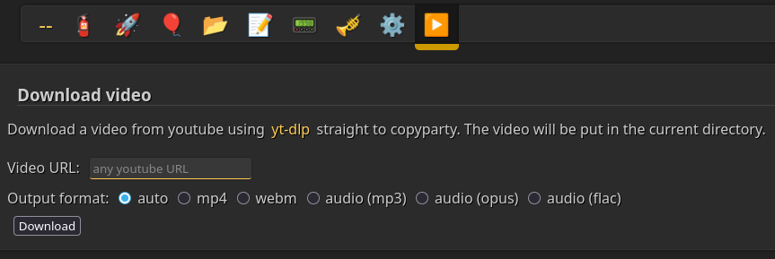

# Copyparty yt-dlp plugin



Download any youtube video directly to copyparty, using just event hooks and a JavaScript file.

## Installation

1. Download `ytdlp_hook.py` and `ytdlp.js`.
2. Add this to your config:
```
[global]
	xm: I,<path to ytdlp_hook.py>
	js-browser: <path to ytdlp.js>

For example:

[global]
	xm: I,/home/user/ytdlp_hook.py
	xm: I,/home/user/ytdlp.js
```
> [!NOTE]
> You can also use command-line arguments (`--xm=I,ytdlp_hook.py --js-browser=ytdlp.js`) of course.
3. Download [yt-dlp](github.com/yt-dlp/yt-dlp/releases/latest) and put it the file next to the copyparty binary.
4. Now start copyparty and open up the ▶️-icon in the menu bar, enter a video URL and click Download. The video will now be (after a bit of waiting) in the folder you're currently in.

> [!NOTE]
> If you can't convert videos, then it's possible that yt-dlp can't be found. In that case, try to put it in `/usr/bin/` or in another directory that is in the `PATH`.

## Features

- *seamless* integration into the browser UI
- transcoding into mp4, webm, mp3 and opus
- only users with the `w` permission can upload videos into a volume

## TODOs

- progress bar of some kind
- auto-download and auto-update for yt-dlp
- there isn't a whole lot more possible with just hooks alone ¯\\\_(ツ)\_/¯